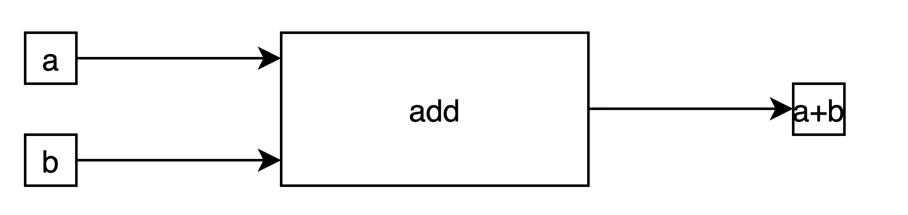

# Parallel Programming and Vectorised Instructions - Part 2

- [Parallel Programming and Vectorised Instructions - Part 2](#parallel-programming-and-vectorised-instructions---part-2)
- [Intro](#intro)
- [Quick Recap](#quick-recap)
- [OpenMP](#openmp)
- [Vectorised Instructions](#vectorised-instructions)
  - [Usage](#usage)
- [OpenMP Vectorisation](#openmp-vectorisation)
  - [Results](#results)
- [Different compute behaviours](#different-compute-behaviours)
  - [Cache](#cache)
  - [Memory-bound vs compute-bound](#memory-bound-vs-compute-bound)
- [Conclusion](#conclusion)
- [Exercises](#exercises)
- [Sources](#sources)
    - [OpenMP](#openmp-1)
    - [Vectorised Instructions](#vectorised-instructions-1)

# Intro

Last week we covered some of the basics of OpenMP, and today we'll be going over some more practical examples, some tips, as well as a few extra OpenMP techniques.

At the end of the talk we'll be briefly going over vectorised instructions.

Notes and code can be found [here](https://github.com/Michael-Beukman/HPC-InterestGroup/tree/main/parallel_programming/02_omp_vectorised).

# Quick Recap

For a quick recap, OpenMP is a shared memory, single node parallel programming environment.

Please see [here](https://github.com/Michael-Beukman/HPC-InterestGroup/blob/main/parallel_programming/01_omp/README.md) for more details.

- Shared memory → Threads can access the same memory locations, and thus influence some shared variables. Each thread can also have private data that only it can access.
- Single Node → Runs on multiple cores on one machine.

The core components of an OpenMP program are:

```cpp
// need this
#include <omp.h>
#include <stdio.h>

int main(){
    // make a parallel region
#pragma omp parallel
    {
        printf("Hello, I am thread number %d out of %d threads\n", omp_get_thread_num(), omp_get_num_threads());
    }
    return 0;
}
```

Using the above, you can do many things (albeit maybe a bit manually), because you have access to

- the current thread id
- the total number of threads

and using that, you should be able to partition your problem and solve it in parallel.

We also have a useful `parallel for` construction.

# OpenMP

Let's consider a running problem to calculate $\pi$.

The derivative of $\arctan(x)$ is $\frac{1}{1 + x^2}$, and we know $\arctan(1) - \arctan(0) = \frac{\pi}{4}$

Thus, $\pi = 4 \int_0^1{\frac{1}{1 + x^2}}$, and we can calculate $\pi$ using a Riemann sum.

The idea here is simple, define a small $dx$, and then compute

$\sum_{i=0}^N {f(x) dx}$, where $N$ is how many chunks we need to integrate, i.e. $\lceil{\frac{1}{dx}}\rceil$

And we can do the same in code, like here:

```cpp
double calc_integral(double x_start, double x_end, double dx) {
    double ans = 0;
    double x;
    // our counter
    int i;
    // how many loop iterations should we do
    int n = ceil((x_end - x_start) / dx);
    for (i = 0; i < n; ++i) {
        // get x
        x = i * dx + x_start;
        // increment ans
        ans += dx * 4.0 / (1.0 + x * x);
    }
    // return
    return ans;
}
```

The serial code is simple, we just call the above

```cpp
double calc_integral_serial(double dx) {
    return calc_integral(0.0, 1.0, dx);
}
```

And the parallel code is also relatively simple, we let each thread perform one section of the integration (e.g. if there are 3 threads, then thread 0 will integrate from 0 to 0.333, thread 1 will integrate from 0.3333 to 0.666 and the last thread will integrate from 0.6666 to 1), and the final answer will be the sum of the sub-answers (as you can split integrals like $\int_a^bf(x)dx = \int_a^cf(x)dx + \int_c^bf(x)dx$ )

```cpp
double calc_integral_par(double dx) {
    // a global answer, the total
    double global_ans = 0.0;
    // make a parallel region
#pragma omp parallel
    {
        // how many threads do we have?
        int num_threads = omp_get_num_threads();
        // what is my id
        int my_id = omp_get_thread_num();
        // how much should each thread integrate
        double per_thread = 1.0 / (double)num_threads;
        // where should I start and end
        double my_start = my_id * per_thread;
        double my_end = (1 + my_id) * per_thread;
        // get my answer
        double my_ans = calc_integral(my_start, my_end, dx);
        // now, this increment should not happen concurrently, as we might have a race condition.
        // Hence the omp atomic that ensures only one update at a time occurs.
#pragma omp atomic
        global_ans += my_ans;
    }

    return global_ans;
}
```

Or, we could alternatively use the parallel for:

```cpp
double calc_integral_par_for(double dx) {
   double ans = 0;
    double x;
    // our counter
    int i;
    // how many loop iterations should we do
    int n = ceil((1.0 - 0.0) / dx);
    #pragma omp parallel for private (x) reduction(+:ans)
    for (i = 0; i < n; ++i) {
        // get x
        x = i * dx;
        // increment ans
        ans += dx * 4.0 / (1.0 + x * x);
    }
    // return
    return ans;
}
```

Results, relatively respectable speedup on 4 cores, and our 'manual' way is basically the same as the `parallel for` option.

```cpp
Correct answer = 3.141593
| Method                    | Correct Answer  | Time (ms)        | Speedup |
-----------------------------------------------------------------------------
| Serial                    | YES             | 118.56    ± 17.4 | 1.00    |
| Parallel                  | YES             | 32.69     ± 7.2  | 3.63    |
| OMP Parallel For          | YES             | 30.33     ± 4.4  | 3.91    |
```

# Vectorised Instructions

Vectorised instructions are a form of CPU instructions where a single operation is performed on  multiple data, in parallel, on one CPU core. A common name for this is SIMD (single instruction multiple data). 

The main structure here is that instead of calling one operation 4 times, we have a new, special instruction that takes in 4 times the data, and performs the same instruction on each element, in a comparable number of clock cycles as the original instruction.

Normal Instructions:



Vectorised Instructions:


There are many types of these instructions (e.g. SSE, AVX, AVX2, AVX512), but they are quite similar in principle. 

We will be considering the AVX (Advanced Vector Extensions) instructions here, specifically AVX2.

Each of these methods can process a certain register size at once. Specifically:

AVX: 128 bits

AVX-2 : 256 bits

AVX-512: 512 bits.

These bits can mostly be split up how you like, for example, we could make up a single 256 bit register from 8 floats (32 bits each), 4 doubles (64 bits each), 16 shorts (16 bits each), etc.

Concretely, we can use these instructions in the following way:

- declare some variables of the correct type
- initialise them properly
- call some operation on them.

[This](https://software.intel.com/sites/landingpage/IntrinsicsGuide/) site is a very useful reference.

**Much of the following comes from [here](https://www.codeproject.com/Articles/874396/Crunching-Numbers-with-AVX-and-AVX)**

The data types are then (two underscores)

`__m256d` → (4) doubles

`__m256`   → (8) floats

`__m256i` → (x) integers.

For AVX2, the instructions have the following form:

`_mm<nbits>_<operation>_<type>`, where `<nbits> = 256`

The operation can be something like `add`, `mul`, `sub`, or `set`, `set1`, `setzero`.

The datatypes can be (among others):

- `ps` → floats (packed single precision)
- `pd` → double (packed double precision)
- `epi8/epi16/epi32/epi64` → signed integers with x bits.
- `epu8/epu16/epu32/epu64` → unsigned integers

## Usage

Note, you need to compile using the flag `-mavx2`, or `-m<instructions>` when using these special instructions, and it won't work on CPUs that don't support them. `lscpu` should tell you what flags / instructions are supported on your CPU.

Here is the above code using the AVX 256 instructions

```cpp
double calc_integral_avx(double x_start, double x_end, double dx) {
    // All our variables here are __m256d, i.e. 256 bit wide array of doubles.
    // intermediate answer. _mm256_setzero_pd() does the following:
    // _mm256 -> 256 buts
    // setzero -> set to 0
    // pd -> doubles
    __m256d _ans = _mm256_setzero_pd();
    // four, we use set1, to set all values in the array to the same value.
    __m256d _four = _mm256_set1_pd(4.0);
    // four multiplied by dx, set1 again
    __m256d _four_dx = _mm256_set1_pd(4.0 * dx);
    // use one
    __m256d _one = _mm256_set1_pd(1.0);
    // our dx, i.e. how large are our steps
    __m256d _dx = _mm256_set1_pd(dx);
    // _mm256_set_pd allows you to set each element, and we set that to 0, dx, 2dx, 3dx, i.e. the first four values of x.
    // We add to that x_start, which offsets us to start where we should
    __m256d _x = _mm256_add_pd(
        _mm256_set_pd(0.0, 1.0 * dx, 2.0 * dx, 3.0 * dx),  // +
        _mm256_set1_pd(x_start));

    // While we haven't reached the end. This has the potential to cause problems in the case where
    // _x[0] < x_end, but _x[3] isn't. For our use case here, since our dx is quite small, we won't have that issue, but it
    // is potentially better to make this check more sophisticated.
    while (_x[3] < x_end) {
        // The following is just executing: ans = ans + 4/(1 + x * x) * dx
        _ans = _mm256_add_pd(_ans,
                             _mm256_div_pd(_four_dx,
                                           _mm256_add_pd(_one, _mm256_mul_pd(_x, _x))));

        // This is basically doing x += dx, but since we use 4 numbers at once, we need to jump 4 spaces further.
        _x = _mm256_add_pd(_x, _four_dx);
    }
    // at the end, _ans contains 4 subtotals, so we total them up.
    return _ans[0] + _ans[1] + _ans[2] + _ans[3];
} 
```

# OpenMP Vectorisation

So the above is nice and all, but it's not always fun, fast or bug-free to write these things ourselves.

OpenMP provides another directive, the [SIMD](https://www.openmp.org/spec-html/5.0/openmpsu42.html) one, which basically attempts to do the above for us. You can use it in a similar fashion as the `parallel for` directive, as shown here:

```cpp
double calc_integral_omp_simd(double dx) {
    // normal setup
    double ans = 0;
    double x;
    int i;
    int n = ceil(1.0 / dx);
    
    // we use the directive as normal, with a reduction
    #pragma omp simd reduction(+:ans)
    // This loop must be in 'canonical form' (https://www.openmp.org/spec-html/5.0/openmpsu40.html#x63-1260002.9.1), which basically looks like a normal for loop.
    // It must be something like for (x = start; x < P; x += y)
    for (i = 0; i < n; ++i) {
        // normal loop
        x = i * dx;
        ans += dx * 4.0 / (1.0 + x * x);
    }
    // answer
    return ans;
}
```

And, the great thing is we can combine this with the `parallel for` directive to get the best of both worlds

```cpp
double calc_integral_omp_simd_and_par_for(double dx) {
    // standard
    double ans = 0;
    double x;
    int i;
    int n = ceil(1.0 / dx);
    // only change -> add in parallel for
    #pragma omp parallel for simd reduction(+:ans)
    // loop is the same
    for (i = 0; i < n; ++i) {
        x = i * dx;
        ans += dx * 4.0 / (1.0 + x * x);
    }
    return ans;
}
```

## Results

For the calculating  code, we have the following results for a few different methods:

AVX instructions can provide a massive speedup, and that can be combined with openmp to get great speedups. This is on 4 cores, and the final speedup we get is about `7-8x` when using both AVX and parallelism.

It is interesting to see that the OpenMP SIMD results are basically the same as our (tedious) hand coded results, so it did a very good job of vectorising our code for us (or we did a very bad job...)!

Interestingly AVX1 also seems to do relatively well.

```cpp
Correct answer = 3.141593
| Method                    | Correct Answer  | Time (ms)        | Speedup |
-----------------------------------------------------------------------------
| Serial                    | YES             | 118.56    ± 17.4 | 1.00    |
| Parallel                  | YES             | 32.69     ± 7.2  | 3.63    |
| OMP Parallel For          | YES             | 30.33     ± 4.4  | 3.91    |
| AVX 128 Serial            | YES             | 68.52     ± 2.4  | 1.73    |
| AVX 128 Par               | YES             | 20.97     ± 3.5  | 5.65    |
| AVX 256 Serial            | YES             | 54.08     ± 3.8  | 2.19    |
| AVX 256 Par               | YES             | 14.50     ± 1.1  | 8.17    |
| OMP SIMD                  | YES             | 54.83     ± 2.9  | 2.16    |
| OMP SIMD + FOR            | YES             | 17.10     ± 2.8  | 6.93    |
```

# Different compute behaviours

Not all programs will benefit equally from all techniques, and this depends on the characteristics of the program / algorithm. One thing that is important in basically all cases is cache.

## Cache

Cache is small, super fast memory located on / near the CPU itself, and is used to store recently used values, as if they are used again shortly afterwards, then the data can be fetched from the cache instead of the (comparatively) slow RAM.

Accessing RAM is **much** slower than accessing cache, so making good use of cache is crucial to high speed applications.

## Memory-bound vs compute-bound

For some applications, using AVX256, parallel programming, etc will be of very much use, and it will increase the speed by a lot. In other cases, this won't necessarily help. 

The above is determined by the characteristics of a program, specifically if it is compute limited or memory bandwidth limited. Memory bandwidth is basically how much data you can move from memory to the cache in a certain time. 

Some programs really need this, and they access memory very often, and need the data to actually perform computations with. In these cases, using more threads or using better instructions won't always help, because raw compute isn't the limiting factor.

Other programs are limited by compute, they don't need so much data. In these cases, more compute / threads / faster CPUs can help.

It's useful to consider these aspects when looking at a problem, and not being aware of this can often lead to wasted time and worse performance.

You can often roughly check if a program / problem is memory limited by calculating how many memory accesses you make per floating point operation (i.e. add, multiply, etc).

[https://web.corral.tacc.utexas.edu/CompEdu/pdf/stc/EijkhoutIntroToHPC.pdf](https://web.corral.tacc.utexas.edu/CompEdu/pdf/stc/EijkhoutIntroToHPC.pdf), page 47 has some more detail on this topic.

# Conclusion

So, in this talk we considered the following:

- Some OpenMP examples
- A primer on vectorised instructions and how to use them
- How different programs can have different compute characteristics and the same strategy won't work for all methods.

And the moral is that you don't necessarily need to code everything from scratch, OpenMP provides easy ways to add these performance enhancing features to your programs. Be aware though, that these things don't always help, and in some, more complex cases, it might be best to write it yourself.

# Exercises

- Implement some usually slow operation using any of the above techniques
    - For example, dot product, matrix-matrix multiplication
- Write a general integration function that can integrate any function between any bounds, and potentially make python bindings for this function, to be able to easily call it.

# Sources

Here are lots of sources for you to explore.

### OpenMP

- [Victor Eijkhout's Parallel Programming Book](https://web.corral.tacc.utexas.edu/CompEdu/pdf/pcse/EijkhoutParallelProgramming.pdf), Chapters 16+
    - Very good book about OpenMP + MPI. Would definitely recommend reading through some of the chapters to get a better understanding. There are many more OpenMP features we didn't cover, and they could be useful for some purposes.
- [OpenMP SIMD](https://www.openmp.org/spec-html/5.0/openmpsu42.html)
- [http://www.inf.ufsc.br/~bosco.sobral/ensino/ine5645/OpenMP_Dynamic_Scheduling.pdf](http://www.inf.ufsc.br/~bosco.sobral/ensino/ine5645/OpenMP_Dynamic_Scheduling.pdf)
- Wits Honours HPC course

### Vectorised Instructions

- [Rendering the Mandelbrot set using AVX-256 instructions](https://www.youtube.com/watch?v=PBvLs88hvJ8)
- [Tutorial / Blog on these instructions](https://www.codeproject.com/Articles/874396/Crunching-Numbers-with-AVX-and-AVX)
- [Intel Tool for finding documentation](https://software.intel.com/sites/landingpage/IntrinsicsGuide/)
- [https://github.com/2b-t/OMP-AVX-intrinsics-dotprod](https://github.com/2b-t/OMP-AVX-intrinsics-dotprod)
    - Good exploration of different techniques to optimise the dot product.
- [https://www.csie.ntu.edu.tw/~cyy/courses/assembly/12fall/lectures/handouts/lec17_x86SIMD.pdf](https://www.csie.ntu.edu.tw/~cyy/courses/assembly/12fall/lectures/handouts/lec17_x86SIMD.pdf)
    - Some notes on SIMD instructions
- [Cache and Computing](https://pages.tacc.utexas.edu/~eijkhout/istc/html/sequential.html#Caches:on-chipmemory)
    - Victor Eijkhout's HPC book
- [https://stackoverflow.blog/2020/07/08/improving-performance-with-simd-intrinsics-in-three-use-cases/](https://stackoverflow.blog/2020/07/08/improving-performance-with-simd-intrinsics-in-three-use-cases/)
    - Another great blog about some practical use cases.