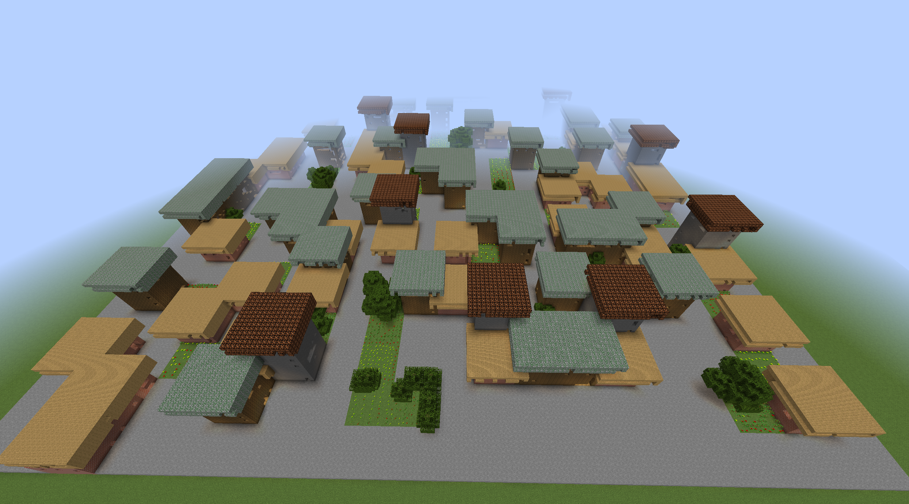
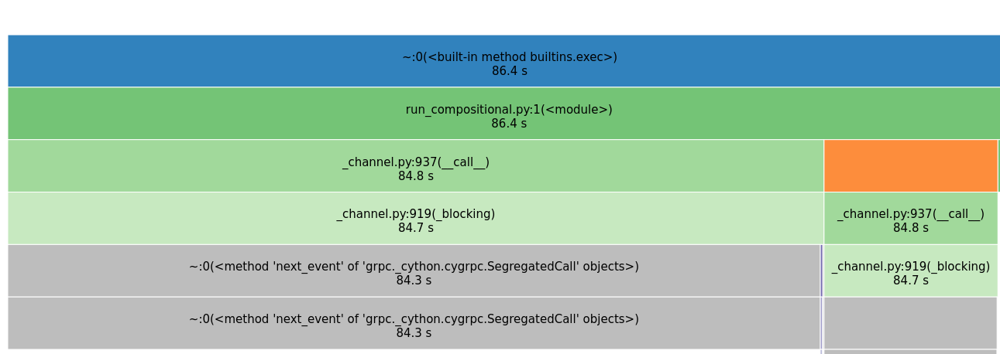

# Python Code Optimisation

## Intro
Today we'll be going over how to optimise code in Python, and will end with a real-world use case.

---

## Optimising Code
In general, optimising code is useful, and is often much easier than modifying the hardware something runs on.
There are a few considerations to take into account when optimising, though:

1) First, is optimisation necessary
	+ If it takes 200ms and that is fast enough, optimisation effort is largely wasted
2) If so, what parts of the code should you optimise
	+ If two parts, A & B make up the code. If part B takes 90% of the time, is optimising part A really that worth it?
3) Finally, how do you go about optimising it?

---

## Profiling
Once we decide we do need to optimise something, what code should we change or specifically optimise?

+ We can find this out by *profiling* our code, to see which parts or functions take the most amount of time.
+ For Python code, we can make use of two tools, `cProfile` and `snakeviz`. To install `snakeviz`, run `pip install snakeviz`.
	+ Then, to create a profile, run it using `python -m cProfile -o temp.dat /path/to/my/script.py`
	+ And view it by doing `snakeviz temp.dat`
	+ This gives you a nice visual indication of what is taking the most time, and where it would be fruitful to optimise first.

---

## Measuring the time it takes to run code
In Python, the following snippet can be used to measure the time it takes to run some code:

```
from timeit import default_timer as tmr # import

start_time = tmr()
... # code to time goes here
end_time = tmr()
duration_in_seconds = end_time - start_time
```

+ You can also use `timeit` to run the same snippet multiple times to get a more accurate measurement of how long it takes.
+ In Jupyter Notebooks, using `%%timeit` at the top of a cell will you how long it took to run.
---

## Fixing
Now, once you have identified what code is slow, how do you actually make it faster?
+ Analyse and improve the complexity of the code
+ In Python, try to replace (slow!) loops with e.g. numpy vectorised operations.
	+ Most of the work is done in `C`.
+ Caching
	+ Bandwidth vs latency
+ Are you wasting work (i.e. recomputing things) that could be saved by
	+ pre-computing
	+ memoising the previous results

---

## Examples
1. Searching for names in a list
2. Why Python loops are not the best
3. [Generating Cities in Minecraft](https://github.com/Michael-Beukman/Evocraft22_PCGNN)
	

---
## Example 1
```
def v1_baseline_search_for_names_in_list(queries: List[str], names_to_search_in: List[str]) -> List[int]:
    list_of_answers = []
    for q in queries:from 
        for i, n in enumerate(names_to_search_in):
            if q == n:
                list_of_answers.append(i)
                break
        else:
            list_of_answers.append(-1)
    return list_of_answers

```

---

## Example 1 - Fixes

The main issue is that the loop searches through the entire `names_to_search_in` list for each element in `queries`! This is effectively quadratic complexity. 

+ Solution: Precompute the index for every element, so that we can get the index in constant time.
+ This uses a hashmap, or dictionary in python

---
## Example 1 - Solution
```
def get_dictionary(queries: List[str], names_to_search_in: List[str]) -> Dict[str, int]:
    return {n: i for i, n in enumerate(names_to_search_in)}

def v2_precompute(queries: List[str], names_to_search_in: List[str]) -> List[int]:
    dictionary_of_value_to_index = get_dictionary(queries, names_to_search_in)
    list_of_answers = []
    for q in queries:
        list_of_answers.append(dictionary_of_value_to_index.get(q, -1))
    return list_of_answers

```
+ Much faster!
---

## Example 2
+ The dot product between two lists `a` and `b`
	+ Naive: `sum([i * j for i, j in zip(a, b)])`
	+ Numpy: `np.dot(a, b)`
+ Times:
	+ Naive: `~250ms`
	+ Numpy: `~1.2ms`
+ A Massive increase in speed!
+ This can be impactful when dealing with any type of numerical data, e.g. images: Avoid loops in Python and rely on vectorisation.

---

## Example 3 - Optimising the Code
Here, the main slow part is the `run_compositional.py` script.

+ Seems like the `clear_all` function takes around 20 seconds
+ The main other thing is the `'SegregatedCall` function from grpc.

---

## Fixes

One fix is to batch the calls to the grpc code better -- rather send every 10000 blocks instead of every 100 blocks.

Line 50:
```
if len(blocks_list) >= 100:
```
Change to
```
if len(blocks_list) >= 10000:
```

+ Massive speedup!
+ Similarly, line 20 `L = 100` to `L = 500` batches these calls more.
---

## Conclusion
+ Code Optimisation can be very useful, and could save you a lot of time.
+ It is important to know if optimisation is even worth it though
	+ In some cases it very much is, in others it may just be wasting time.

---

## Sources and Extra Reading
- https://docs.python.org/3/library/profile.html
- https://jiffyclub.github.io/snakeviz/
- https://www.youtube.com/watch?v=m_a0fN48Alw
- https://blog.paperspace.com/numpy-optimization-vectorization-and-broadcasting/