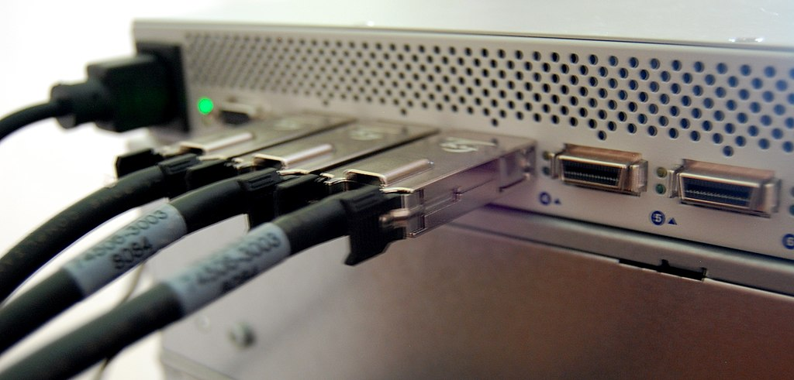
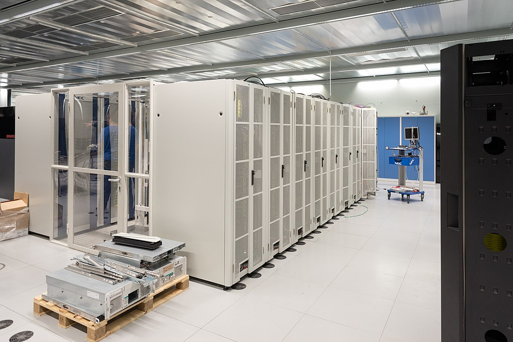

# Hardware
A core part of HPC is hardware - the physical components that actually execute the instructions.

## Processing
The part of the cluster that actually does the compute.
- Central Processing Unit (CPU)
- Has several factors
  - Cores: How many independent processing units does this CPU have (between 4 and ~64)
  - Clock Speed (GHz): How many instructions can be performed per second.

  
  
  
  D-Kuru/Wikimedia Commons | Andrew Dunn/Wikimedia Commons

## Memory
The components that stores all of the data that the CPU processes. There are generally several layers to the memory hierarchy:
1. Storage: The slowest, stores large amounts (TBs) of data that isn't currently being worked on.
2. Memory (RAM): Faster than storage, stores medium amounts (GBs, but can also be multiple TBs) of data that is currently being processed. Still much slower than the CPU.
3. Cache: This is on-chip memory that is very small (MBs) but also very fast. Generally, data from memory is transferred to the cache, which is then read by the CPU. If that data is used again shortly thereafter, it doesn't  have to be fetched from memory.

  

## Storage
This stores data, and is non-volatile, meaning that it can retain the data even when the machine is switched off (in contrast to e.g. RAM which loses its data if the power turns off). 
There are several types of storage technologies, in order from slowest to fastest.

  
  

  Evan-Amos/Wikimedia Commons | ガラパリ/Wikimedia Commons

- Hard Drives
- SATA Solid State Drives (SSDs)
- NVME SSDs

## Accelerators
While CPUs are general purpose, and can do everything, other types of processing units exist. These are more special-purpose, and won't necessarily be better in general.
The most common accelerators are Graphics Processing Units (GPUs), originally developed for games. These chips are very good at doing matrix multiplication fast and have subsequently been used in many scientific applications, from fluid dynamics to machine learning.

These chips obtain massive speedups by running operations in parallel across many different cores, as opposed to running operations in sequence. Thus, they are only applicable to a particular set of problems.

  

  Adam Kapetanakis/Wikimedia Commons

## Networking
In HPC, we do not only have one node - we connect multiple nodes together via *networking*. In its simplest form, this is e.g. just connecting nodes to each other with ethernet cables.
But more complex components, such as switches, could also be used. Furthermore, the speed of network connectivity is ever-increasing, as improving communication speed can lead to massive performance improvements overall.

  

  ChrisDag/Wikimedia Commons

## Clusters

Clusters are effectively lots of nodes connected together via some sort of network. Generally, these nodes are inside the same datacenter, stacked in many rows of racks - each rack containing multiple nodes and each node likely containing multiple CPUs and many cores.

  

  Julian Herzog/Wikimedia Commons

## Coding for this hardware
Generally, how we are taught programming is pretty platform agnostic. Chances are that the software you write for your undergrad programming course will work on pretty much any hardware (after a successful compilation step). However, to take full advantage of HPC hardware, we often need specialised code. For instance, if you write code that runs only on a single core, giving it access to 64 cores on a single CPU will not do anything. Similarly, if your program does not deal with network and multiple nodes explicitly, giving it 100 nodes will not help at all. Likewise, code written for a CPU will probably not run on a GPU without modifications.

In this way, our code has to somewhat acknowledge the hardware we run on.